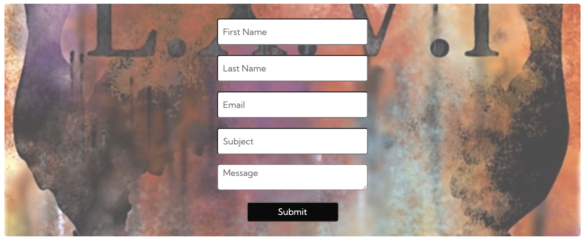

<h1 align="center">My First Project</h1>
Project Link: <a href="https://mattdunks94.github.io/my-first-project/index.html">My First Project</a>

This is a website displaying artwork by Brighton based artist, Matt Dunkerton. 
Users of this website will be able to access Matt Dunkerton's art portfolio through a gallery display, artist description and contact information. 
It is designed to be responsive and acccessible on a variety of devices and is easy to navigate throughout the site. 
Target audience for the site is for art, comic, graphic and tattoo fanatics of any age.

<h2>Features</h2>

### - Navigation & Header
<ul>
  <li>The navigation & header are displayed at the top of the page. The 'Hero-Image' is part of the header but is also a link which leads back to the homepage (index.html).</li>
  <li>The navigation links are displayed below the 'Hero-Image'. Home takes the user to the homepage (index.html), About and Gallery takes the user to different sections of the same page (index.html). Contact takes the user to a different page (contact.html).</li>
  <li>The navigation links are easily readable thanks to the contrast of the two colors used. The text is white with the background being black, this causes the links to stand out.</li>
  <li>The navigation links are also displayed evenly with a large margin. This makes them easier to access and avoids the user from making contact with an undesired link, especially when on a mobile device.</li>
  <li>The header displays the logo of the artist and the navigation makes it easy for the user to find different sections of the website.</li>
</ul>

### - About Section
<ul>
  <li>The about section is an introduction to the website and the artist. It mentions what type of artist Matt is and where he is based.</li> 
  <li>It also contains a internal link to the 'Gallery' section, styled in 'dodgerblue', within the same page (index.html). This entices the user to view the 'Gallery' section.</li>
  <li>The text is easily readable due to the contrasting colors used (black, grey #0a0a0a15). The grey background emphasises the about section, acts as a seperator from other sections.</li>
</ul>

### - Gallery Section
<ul>
  <li>The gallery section presents three different galleries to the user. Each gallery has it's own page, internal links.</li>
  <li>All galleries have been styled with a hover effect. This effect highlights what gallery the user is choosing.(as shown in image below). When hovering over the galleries the brightness is increased and a box-shadow appears, along with the headings color changing from white to yellow.</li>
  <li>Each sub-heading for each gallery has an icon added. Each icon is relevant to the heading which enables the user to visually understand what each gallery/link consists of.</li>
</ul>

### - Logo Section
<ul>
  <li>The logo section consists of Matt Dunkerton Art Logo image and is positioned above the footer.</li>
  <li>This image is also a link to the homepage (index.html). This makes it easier to access the homepage when viewing the bottom half of each page, user doesn't have to scroll back up.</li>
  <li>This link is displayed on all pages.</li>
</ul>

### - Footer Section
<ul>
  <li>The footer section consists of copyright and external social links. These links lead to Facebook, Instagram and Twitter.</li>
  <li>Each link has it's relevant social media icon so the user knows what site they have access to.</li>
</ul>

### - Paintings, Drawings & Flash.html 
<ul>
  <li>All three files presents a gallery display of Matt Dunkerton's work.</li>
  <li>Each page has it's own welcome section explaining what the user can expect from each gallery.(Images below)</li>
  <li>All three pages have the same design layout, keeping it consistent was an important factor, creates a sense of identity throughout the website.</li>
</ul>

### - Gallery Links Section
<ul>
  <li>The gallery links section is displayed within the three gallery html.files (paintings, drawings & flash.html), positioned underneath each image gallery.</li>
  <li>It's purpose is to make it easier for the user to access other galleries when viewing the bottom half of each page. Saves the user having to scroll back up to the navigation section.</li>
  <li>The links are styled in 'dodgerblue' and with an arrow icon which makes them stand out as a clickable link.</li>
</ul>

### - Contact Form Section
<ul>
  <li>The contact section consists of a form. This form can be filled out by the user to get into touch with the artist.</li>
  <li>Each input has a placeholder, so the user knows what details to provide. Inputs include first name, last name, Email, subject and a message, text-area for their enquiry.</li>
  <li>The form is visually accessible. The inputs are white with black text and the submit is the opposite. The submit button also has a hover effect where the colors of the button swap over.</li>
  <li>It also has a background-image which allows the form to stand out.</li>
</ul>

### - Features For The Future
<ul>
  <li>Video section. Wanted to add video/media to the site but was unable to accomplish this due to technical issues.</li>
</ul>

<a href="https://en.wikipedia.org/wiki/Greg_Staples">Greg Staples Wikipedia</a> 
<a href=https://www.gregstaples.com>Greg Staples Art Website</a> 
<a href="https://cafans.b-cdn.net/images/Category_4062/subcat_39924/1324.jpg">Judge Dredd vs Alien Original by Greg Staples</a> 
<a href="https://www.instagram.com/p/BuWX9UCBY7R/">Joker Original by Greg Staples</a>
